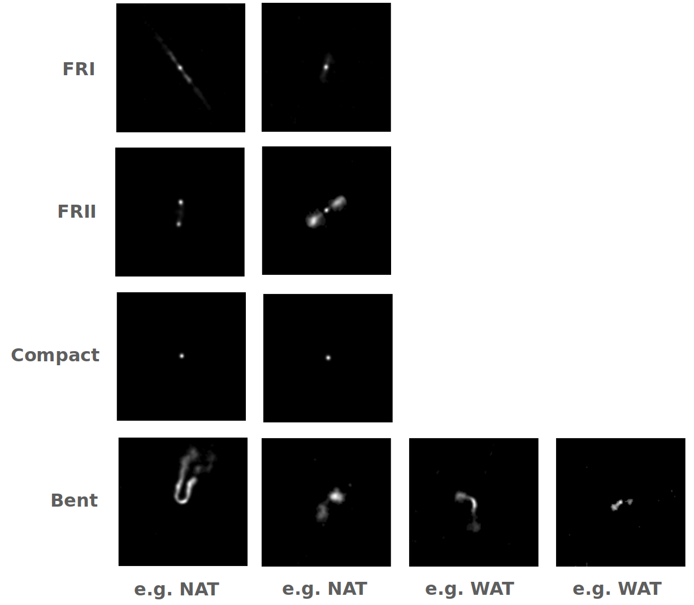

# Radio Galaxy Dataset
[](https://doi.org/10.5281/zenodo.7120632) [](https://github.com/floriangriese/RadioGalaxyDataset/blob/main/LICENSE)

This Radio Galaxy Dataset is a collection and combination of several catalogues using the FIRST radio galaxy survey [[1]](https://ui.adsabs.harvard.edu/abs/1995ApJ...450..559B/abstract).
To the images from the FIRST radio galaxy survey the following license applies:

"Provenance: The FIRST project team: R.J. Becker, D.H. Helfand, R.L. White M.D. Gregg. S.A. Laurent-Muehleisen.
Copyright: 1994, University of California. Permission is granted for publication and reproduction of this material for scholarly, educational, and private non-commercial use. Inquiries for potential commercial uses should be addressed to: Robert Becker, Physics Dept, University of California, Davis, CA  95616:

Further, the following catalogues are included in this dataset:
* MiraBest [[2]](https://academic.oup.com/mnras/article/466/4/4346/2843096), [Source](https://zenodo.org/record/4288837#.YFSBEdwxlaT)
* Gendre [[3-4]](https://academic.oup.com/mnras/article/404/4/1719/1081038?login=true), Supplementary Data: mnras0404-1719-SD1.pdf, data tables CoNFIG-1 to CoNFIG-4
* Capetti 2017a [[5]](https://www.aanda.org/articles/aa/full_html/2017/02/aa29287-16/aa29287-16.html), [Table](https://www.aanda.org/articles/aa/full_html/2017/02/aa29287-16/T1.html)
* Capetti 2017b [[6]](https://www.aanda.org/articles/aa/full_html/2017/05/aa30247-16/aa30247-16.html), [Table](http://cdsarc.u-strasbg.fr/viz-bin/qcat?J/A+A/601/A81)
* Baldi 2018 [[7]](https://www.aanda.org/articles/aa/full_html/2018/01/aa31333-17/aa31333-17.html), [Table](https://www.aanda.org/articles/aa/full_html/2018/01/aa31333-17/T1.html)
* Proctor [[8]](https://ui.adsabs.harvard.edu/abs/2011ApJS..194...31P/abstract), [Table](https://iopscience.iop.org/article/10.1088/0067-0049/194/2/31#apjs390184t1), data from Table 1 with label “WAT” and “NAT”

Examples for the class definitions of FRI, FRII, Compact and Bent are shown below, 

with the labels

| classes    | Label |  
| ----------- | ----------- |
| FRI    | 0  |
| FRII   | 1  | 
| Compact| 2  | 
| Bent   | 3  |

The dataset has the following total number of samples per class.

| classes/split     | FRI |   FRII |     Compact |    Bent |   Total     |
| ----------- | ----------- |----------- |----------- |-----------       |-----------|
| total   | 495        |924       |391       |348       |2158       |

We provide two splitting options for the dataset. 
The first splitting option (galaxy_data_h5.zip) provides three splittings in train, valid and test with the following number of sample per class.

| classes/split     | FRI |   FRII |     Compact |    Bent |   Total     |
| ----------- | ----------- |----------- |----------- |-----------       |-----------|
| train     | 395       |824       |291       |248       |1758       |
| valid   | 50        | 50       | 50       | 50      |200       |
| test   | 50        | 50       | 50       | 50      |200       |
| total   | 495        |924       |391       |348       |2158       |

The second splitting option (galaxy_data_crossvalid_0_h5.zip to galaxy_data_crossvalid_4_h5.zip and galaxy_data_crossvalid_test_h5.zip) provides a 5-fold cross validation dataset with a larger test set.

| classes/split     | FRI |   FRII |     Compact |    Bent |   Total     |
| ----------- | ----------- |----------- |----------- |-----------       |-----------|
| 5-fold cross train   | 316        | 659       | 232       | 198      |1405       |
| 5-fold cross valid   | 79        | 165       | 59       | 50      |353       |
| test   | 100        | 100       | 100       | 100      |400       |
| total   | 495        |924       |391       |348       |2158       |

# Installation usage with pytorch
If you want to use the dataset via the dataset class `FIRSTGalaxyData` with pytorch, install the necessary packages with

`pip3 install -r requirements.txt`

first, otherwise you can use the dataset
* directly with *.png files on disk or
* load the dataset directly from the HDF5 file.

Both options are descibed further below.

# Usage with pytorch
```
from firstgalaxydata import FIRSTGalaxyData
import torchvision.transforms as transforms
```
```
transformRGB = transforms.Compose(
        [transforms.ToTensor(),
         transforms.Normalize(mean=[0.5, 0.5, 0.5], std=[0.5, 0.5, 0.5])])
```
```
data = FIRSTGalaxyData(root="./", selected_split="train", input_data_list=["galaxy_data_h5.h5"],
                           is_PIL=True, is_RGB=True, transform=transformRGB)
```
```print(data)```

This will print out the following output:
```Dataset FIRSTGalaxyData
    Selected classes: dict_values(['FRI', 'FRII', 'Compact', 'Bent'])
    Number of datapoints in total: 1758
    Number of datapoint in class FRI: 395
    Number of datapoint in class FRII: 824
    Number of datapoint in class Compact: 291
    Number of datapoint in class Bent: 248
    Split: train
    Root Location: ./
    Transforms (if any): Compose(
                             ToTensor()
                             Normalize(mean=[0.5, 0.5, 0.5], std=[0.5, 0.5, 0.5])
                         )
    Target Transforms (if any): None
```

## Options
With `selected_split` the data split is selected. Choose either `"train"` or `"valid"` or `"test"`.

With `selected_classes` only data containing the chosen classes is returned. e.g. `["FRI",FRII"]` returns only FRI and FRII images.

With `selected_catalogues` the dataset uses only the selected catalogues. All possible catalogues are listed here:

`selected_catalogues= ["Gendre", "MiraBest", "Capetti2017a", "Capetti2017b", "Baldi2018", "Proctor_Tab1"]`

```data = FIRSTGalaxyData(root="./", selected_split="train", input_data_list=["galaxy_data_h5.h5"], selected_catalogues=selected_catalogues, is_PIL=True, is_RGB=True, transform=transformRGB)```

# Basic usage with files on disk
You will also find the dataset in the 'galaxy_data' folder by unzipping `galaxy_data.zip`.
It contains the following folder sturcture with *.png images. The most import information will also be part of the file name separated by underscores:
`RA_DEC_Label_Source.png`
E.g. `14.084_-9.608_3_MiraBest.png`
```
galaxy_data  
│
└───all
│   │   Bent
|   |       *.png  
│   │   Compact
|   |       *.png  
|   |   FRI
|   |       *.png  
│   │   FRII
|   |       *.png  
│   
└───test
│   │   Bent
|   |       *.png  
│   │   Compact
|   |       *.png  
|   |   FRI
|   |       *.png  
│   │   FRII
|   |       *.png
│   
└───train
│   │   Bent
|   |       *.png  
│   │   Compact
|   |       *.png  
|   |   FRI
|   |       *.png  
│   │   FRII
|   |       *.png
│   
└───valid
│   │   Bent
|   |       *.png  
│   │   Compact
|   |       *.png  
|   |   FRI
|   |       *.png  
│   │   FRII
|   |       *.png
```
 

# Basic usage with HDF5 file 
The dataset can also be accessed via the HDF5 file `galaxy_data_h5.h5`. 
Every data entry consists of a group named `data_$(i)` with `i=1...n` where `n` is the total number of data entries.
Each group consists of the following data:
* `Img`: two-dimensional uint8 array with (300,300)
  * Attributes of `Img`:
  * `RA` right ascension equatorial  coordinate  system (J2000): double
  * `DEC` declination equatorial  coordinate  system (J2000): double 
  * `Source`: string, ["Gendre", "MiraBest", "Capetti2017a", "Capetti2017b", "Baldi2018", "Proctor_Tab1"]
  * `Filepath_literature`: string, relative path to the *.png file in the folder `galaxy_data`
* `Label_literature`: double scalar, 0: ”FRI”, 1: ”FRII”, 2: ”Compact”, 3: ”Bent”
* `Split_literature`: string, ["train","test","valid"]

# References
[1] R. H. Becker, R. L. White, D. J. Helfand, The FIRST Survey: Faint Images of the Radio Sky at Twenty Centimeters,
The Astrophysical Journal 450 (1995) 559.

[2] H. Miraghaei, P. N. Best, The nuclear properties and extended morphologies of powerful radio galaxies: the roles
of host galaxy and environment, Monthly Notices of the Royal Astronomical Society (2017) stx007.

[3] M. A. Gendre, P. N. Best, J. V. Wall, The combined nvss-first galaxies (config) sample - ii. comparison of space
densities in the fanaroff-riley dichotomy, Monthly Notices of the Royal Astronomical Society (2010).

[4] M. A. Gendre, J. V. Wall, The combined nvss-first galaxies (config) sample - i. sample definition, classification
and evolution, Monthly Notices of the Royal Astronomical Society (2008).

[5] A. Capetti, F. Massaro, R. D. Baldi, Fricat: A first catalog of fr i radio galaxies, Astronomy & Astrophysics 598
(2017) A49.

[6] A. Capetti, F. Massaro, R. D. Baldi, Friicat: A first catalog of fr ii radio galaxies, Astronomy & Astrophysics 601
(2017) A81.

[7] R. D. Baldi, A. Capetti, F. Massaro, Fr0cat: a first catalog of fr 0 radio galaxies, Astronomy & Astrophysics 609
(2017) A1.

[8] D. D. Proctor, Morphological annotations for groups in the first database, The Astrophysical Journal Supplement
Series 194 (2011) 31.


